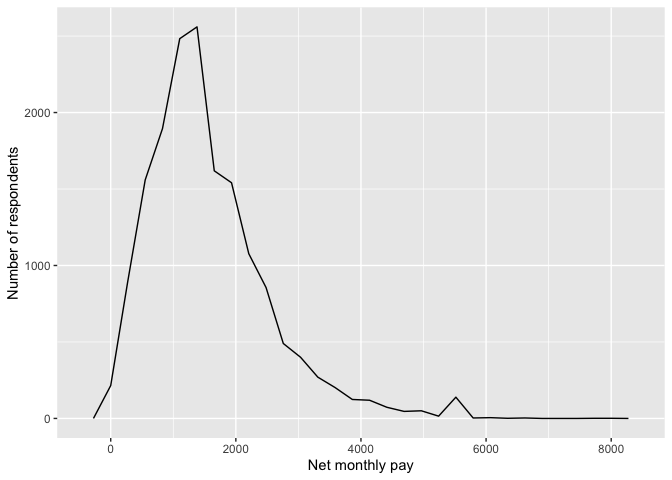
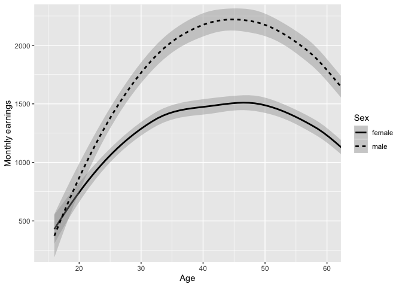
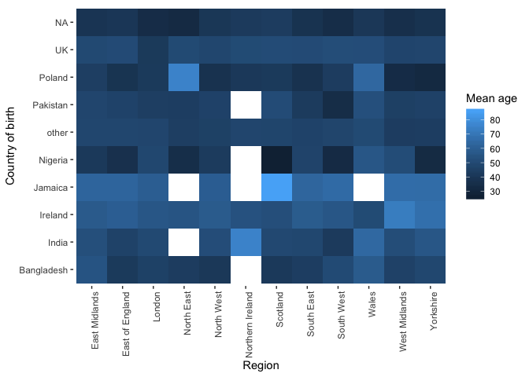
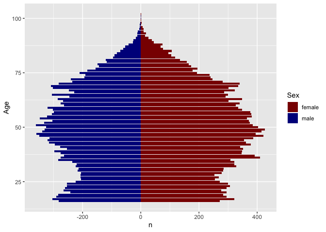

Statistical assignment 4
================
Helen Retzlaff, Student ID:680035432
26.2.2020

In this assignment you will need to reproduce 5 ggplot graphs. I supply
graphs as images; you need to write the ggplot2 code to reproduce them
and knit and submit a Markdown document with the reproduced graphs (as
well as your .Rmd file).

First we will need to open and recode the data. I supply the code for
this; you only need to change the file paths.

    ```r
    library(tidyverse)
    Data8 <- read_tsv("/Users/helenretzlaff/Documents/Data 3/datan3_2020/data/UKDA-6614-tab/tab/ukhls_w8/h_indresp.tab")
    Data8 <- Data8 %>%
        select(pidp, h_age_dv, h_payn_dv, h_gor_dv)
    Stable <- read_tsv("/Users/helenretzlaff/Documents/Data 3/datan3_2020/data/UKDA-6614-tab/tab/ukhls_wx/xwavedat.tab")
    Stable <- Stable %>%
        select(pidp, sex_dv, ukborn, plbornc)
    Data <- Data8 %>% left_join(Stable, "pidp")
    rm(Data8, Stable)
    Data <- Data %>%
        mutate(sex_dv = ifelse(sex_dv == 1, "male",
                           ifelse(sex_dv == 2, "female", NA))) %>%
        mutate(h_payn_dv = ifelse(h_payn_dv < 0, NA, h_payn_dv)) %>%
        mutate(h_gor_dv = recode(h_gor_dv,
                         `-9` = NA_character_,
                         `1` = "North East",
                         `2` = "North West",
                         `3` = "Yorkshire",
                         `4` = "East Midlands",
                         `5` = "West Midlands",
                         `6` = "East of England",
                         `7` = "London",
                         `8` = "South East",
                         `9` = "South West",
                         `10` = "Wales",
                         `11` = "Scotland",
                         `12` = "Northern Ireland")) %>%
        mutate(placeBorn = case_when(
                ukborn  == -9 ~ NA_character_,
                ukborn < 5 ~ "UK",
                plbornc == 5 ~ "Ireland",
                plbornc == 18 ~ "India",
                plbornc == 19 ~ "Pakistan",
                plbornc == 20 ~ "Bangladesh",
                plbornc == 10 ~ "Poland",
                plbornc == 27 ~ "Jamaica",
                plbornc == 24 ~ "Nigeria",
                TRUE ~ "other")
        )
    ```

Reproduce the following graphs as close as you can. For each graph,
write two sentences (not more\!) describing its main message.

1.  Univariate distribution (20 points).
    
    ``` r
    library(ggplot2)
    
    ggplot(Data,
       aes(x = h_payn_dv)) +
      geom_freqpoly() +
      xlim(-100, 9000)+
    xlab("Net monthly pay")+
    ylab("Number of respondents")+
    scale_x_continuous(breaks=seq(0,9000,by=2000))
    ```
    
    <!-- -->

The main message of the graph is that most respondents from the
Understanding Society survey received a net monthly pay between 500-2000
pounds. As the monthy pay gets higher, the lower the number of people
that earn that much, although there is a small peak at the right tale of
the distribution with some respondents earning between 5000 and 6000
pounds per month.

2.  Line chart (20 points). The lines show the non-parametric
    association between age and monthly earnings for men and women.
    
    ``` r
    byAgeSex <- Data %>%
      filter(!is.na(sex_dv)) %>%
      group_by(h_age_dv,sex_dv) %>%
      summarise(
    meanIncome = mean(h_payn_dv, na.rm = TRUE)
      )
    
    byAgeSex %>% 
    ggplot(mapping = aes(x = h_age_dv, y = meanIncome, linetype = sex_dv)) +
    geom_smooth(colour="black")+
    scale_x_continuous(breaks = seq(20,60,by=10))+
    coord_cartesian(xlim = c(15,60),ylim = c(250,2250))+
    xlab("Age") +
    ylab("Monthly earnings")+
    labs(linetype="Sex")
    ```
    
    <!-- -->

The main message of the graph is that women at avery age on average
always earn less than men per month. While their monthly earnings are
quite similar at a young age, the pay gap increases with age and is
highest (around 750 pounds a month) at the age of 45.

3.  Faceted bar chart (20 points).
    
    ``` r
    byPlaceborn <- Data %>%
      filter(!is.na(sex_dv)) %>%
      group_by(sex_dv,placeBorn) %>%
      summarise(
    medianIncome = median(h_payn_dv, na.rm = TRUE)
      )
    
    byPlaceborn %>% 
      drop_na(placeBorn) %>% 
     ggplot() + 
      geom_bar(mapping = aes(x = sex_dv, y = medianIncome),stat = "identity") + 
      facet_wrap(~ placeBorn, ncol = 3)+
    ylab("Median monthly net pay")+
    xlab("Sex")
    ```
    
    <!-- -->

The main message of the graph is that there are differences in the
median monthly net pay depending on sex and country of birth. For
example, both men and women born in Bangladesh earn little (between 750
and 1000 pounds) but there is not a large gap between the genders,
whereas men from Ireland earn around 2000 pounds but women from Ireland
earn around 1400 pounds per month.

4.  Heat map (20 points).
    
    ``` r
    Age <- Data %>%
     filter(!is.na(h_gor_dv)) %>%
     group_by(h_gor_dv,placeBorn) %>%
     summarise(
    meanAge = mean(h_age_dv, na.rm = TRUE)
      )
    
    Age %>%  
      ggplot(mapping = aes(x = h_gor_dv, y = placeBorn)) +
      geom_tile(mapping = aes(fill = meanAge))+
      theme(
      panel.border = element_blank(),  
      panel.grid.major = element_blank(),
      panel.grid.minor = element_blank(),
      panel.background = element_blank())+
      xlab("Region")+
      ylab("Country of birth")+
      labs(fill="Mean age")+
      theme(axis.text.x = element_text(angle = 90, hjust = 1))
    ```
    
    <!-- -->

The main message of the graph is that different regions of the UK have
different age structures depending on the country of birth of their
citizens. For examples, Nigerians are on average quite young (indicated
by darker squares) in all the regions and youngest in Scotland, but
Jamaicans are much older on average and oldest in Scotland.

5.  Population pyramid (20 points).
    
    ``` r
    pyramid<-Data %>% 
      group_by(sex_dv,h_age_dv) %>% 
      count(h_age_dv,sex_dv)
    
    pyramid$n<-ifelse(pyramid$sex_dv=="male",-1*pyramid$n,pyramid$n)
    
    ggplot(pyramid,aes(x=h_age_dv,y=n,fill=sex_dv))+
    geom_bar(data = subset(pyramid,sex_dv=="female"),stat = "identity")+
    geom_bar(data = subset(pyramid,sex_dv=="male"),stat = "identity")+
    labs(fill="Sex")+
    coord_flip()+
    scale_fill_manual(values = c("darkred","darkblue"))+
    xlab("Age")
    ```
    
    <!-- -->

This graph shows the distribution of age for both male and female
participants in the Understanding society data.For both genders, the
distribution is fairly equal; most people are between 35 and 75 years
old and very few people are over 90, representing the normal age
structure in society.
